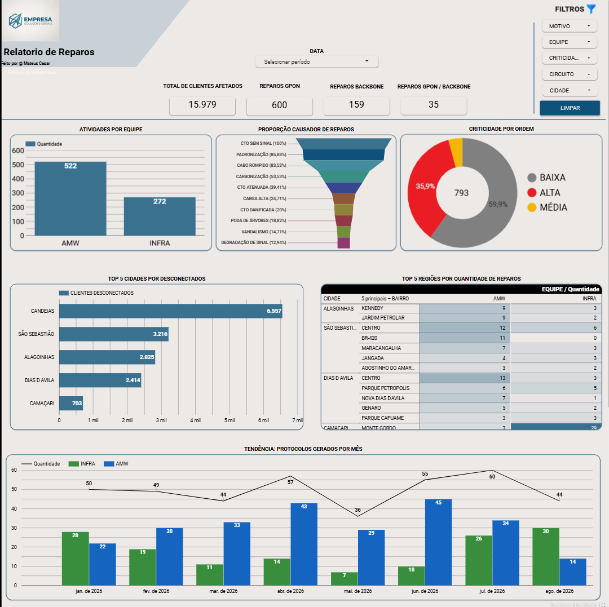
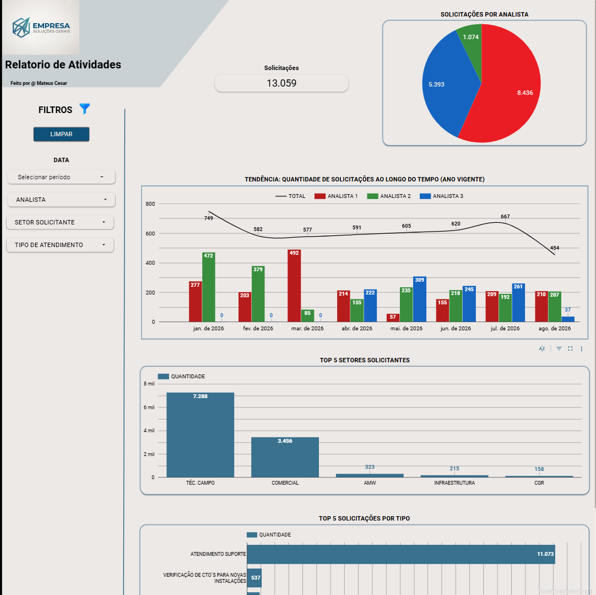
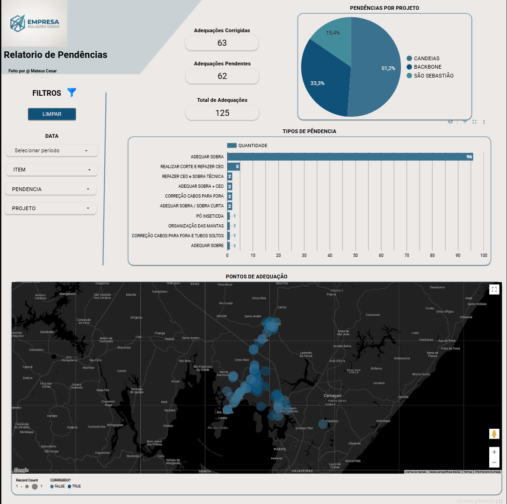
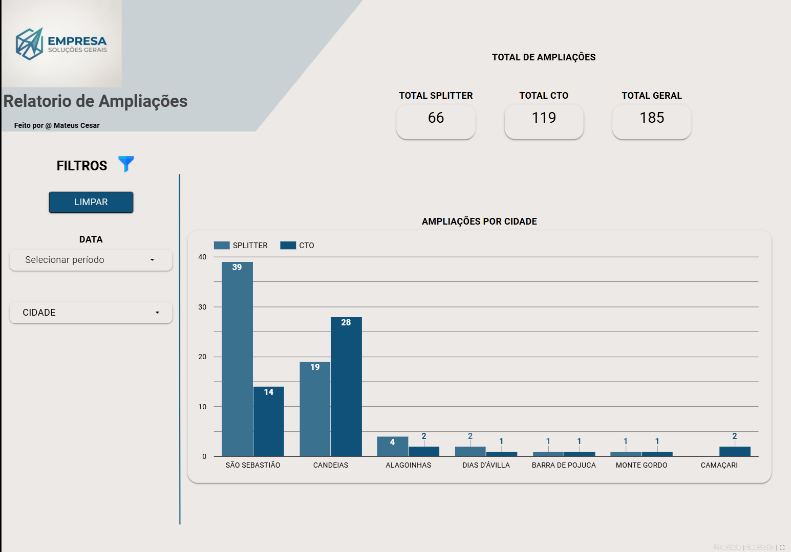

# Telecom Infrastructure & Operations Dashboard — Looker Studio

## 📑 Visualização das Páginas do Dashboard

| 🛠️ Relatório de Reparos | 📈 Relatório de Atividades |
| :---: | :---: |
|  |  |

| ⚠️ Relatório de Pendências | 📡 Relatório de Ampliações |
| :---: | :---: |
|  |  |

---

### 🔗 Acesso ao Dashboard
⚠️ Nota: Os dados apresentados neste repositório e no relatório interativo foram totalmente anonimizados para fins de portfólio
  
[LINK DE ACESSO](https://datastudio.google.com/u/0/reporting/e73db293-7323-451a-913a-ffdbba79512b/page/vJY7F)

---

## 📌 Visão Geral do Projeto
Este projeto apresenta um conjunto de dashboards executivos e operacionais desenvolvidos no **Looker Studio**. O objetivo é centralizar e monitorar indicadores de infraestrutura de telecomunicações, reparos de rede, gestão de pendências técnicas e produtividade das equipes operacionais.

---

## Problema de Negócio & Objetivos
A equipe de operações de rede necessitava de uma visão analítica centralizada para solucionar os seguintes desafios:
* **Monitoramento de Incidentes:** Acompanhar o volume e a gravidade dos reparos em tempo real (GPON vs. Backbone).
* **Análise Geográfica:** Mapear os focos de clientes desconectados para otimizar o deslocamento das equipes de campo.
* **Controle de Pendências:** Acompanhar o volume de adequações de projetos corrigidas vs. pendentes por região.
* **Gargalos Operacionais:** Identificar os principais motivos causadores de reparos na rede (ex: CTO sem sinal, cabo rompido).
* **Produtividade:** Avaliar a evolução temporal e a tendência de atendimentos por analista e setor solicitante.

---

## Tecnologias e Recursos Utilizados
* **Business Intelligence:** Looker Studio
* **Modelagem de Dados:** Campos calculados em SQL / regras de negócio condicionais (`CASE WHEN`)
* **Design & UX/UI:** Layout corporativo moderno com navegação lateral e cartões delimitadores de contexto
* **Tratamento de Dados:** Filtros dinâmicos e regras de controle temporais (semestrais e anuais)

---

## 📈 Estrutura do Dashboard

### 1. Relatório de Reparos
* **KPIs Globais:** Total de clientes afetados, reparos GPON, Backbone e GPON/Backbone.
* **Top Regiões:** Ranking de cidades e bairros com maior volume de desconexões.
* **Causadores & Criticidade:** Funil proporcional com causas de reparo e distribuição por nível de ordem (Baixa, Média, Alta).

### 2. Relatório de Pendências & Ampliações
* **Acompanhamento de Obras:** Visão consolidada de adequações pendentes vs. corrigidas.
* **Distribuição Geográfica:** Tipos de pendências mais recorrentes e mapeamento territorial.

### 3. Relatório de Atividades & Tendências
* **Tendência Temporal:** Gráfico combinado com o volume mensal total e o acompanhamento individualizado de analistas.
* **Demanda Interna:** Ranking dos top setores solicitantes e volumetria por tipo de atendimento.

---

### 🔒 Confidencialidade e LGPD
Nota de Segurança: Os dados apresentados neste repositório e nas imagens de demonstração foram descaracterizados, anonimizados e rotulados com marcas genéricas para assegurar o cumprimento das diretrizes da LGPD (Lei Geral de Proteção de Dados) e contratos de confidencialidade.

---

## Exemplos de Campos Calculados Utilizados

### Filtro Dinâmico para Semestre Vigente/Passado
```sql
CASE
  /* Se estamos no 2º semestre do ano atual (meses 7 a 12), filtra o 1º semestre do mesmo ano */
  WHEN MONTH(CURRENT_DATE()) >= 7 
   AND YEAR(Data) = YEAR(CURRENT_DATE()) 
   AND MONTH(Data) BETWEEN 1 AND 6 
  THEN TRUE

  /* Se estamos no 1º semestre do ano atual (meses 1 a 6), filtra o 2º semestre do ano anterior */
  WHEN MONTH(CURRENT_DATE()) < 7 
   AND YEAR(Data) = YEAR(CURRENT_DATE()) - 1 
   AND MONTH(Data) BETWEEN 7 AND 12 
  THEN TRUE

  ELSE FALSE
END
